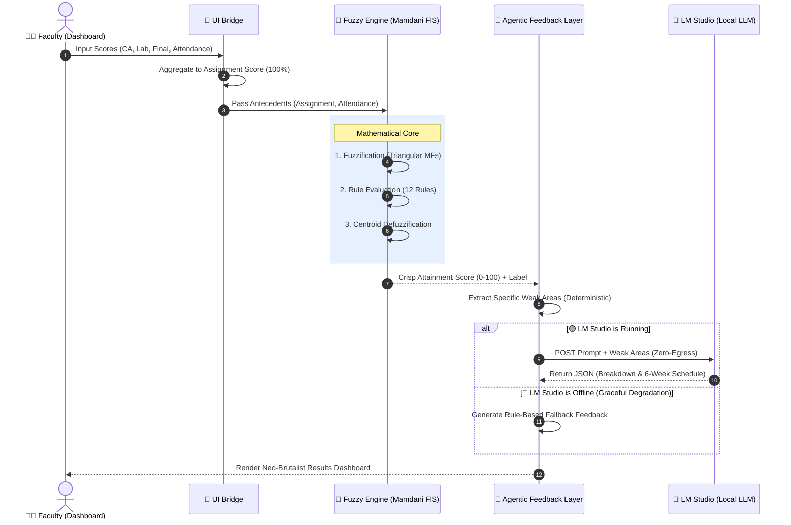

# 🎓 OBE Fuzzy Learning Assessment System


A high-performance **Outcome-Based Education (OBE)** platform that bridges **Mamdani Fuzzy Inference Systems (FIS)** with **Agentic AI** to provide data-driven, privacy-preserving student attainment analysis. 

This repository provides an end-to-end full-stack solution designed for university faculty. It deterministically calculates a student's academic attainment and generates hyper-personalized study schedules based on their precise weak areas.

---

## 🏗️ System Architecture & Data Flow

The system employs a **Hybrid Intelligence Architecture**, coupling the mathematical certainty of Fuzzy Logic with the natural language flexibility of Large Language Models. 

### Core Process Flowchart



---

## 🌟 Deep Dive: Key Components

### 1. The Mamdani Fuzzy Engine (`fuzzy_engine.py`)
Unlike traditional weighted averages, human learning is nuanced. We use **scikit-fuzzy** to map crisp inputs into linguistic terms (e.g., "Poor", "Average", "Good").
* **Antecedents (Inputs)**: `Assignment Score` (combination of CA, Lab, and Final) and `Attendance`.
* **Rules**: 12 custom rules governing attainment logic. For example: 
  * *If (Assignment is Poor) AND (Attendance is Poor) THEN (Attainment is Poor).*
* **Defuzzification**: Uses the **Centroid method** to collapse the activated fuzzy sets back into a precise "Crisp Attainment Percentage."

### 2. Agentic AI Integration (`agentic_feedback.py`)
This is the "Brain" of the system. It takes the mathematical output of the FIS and translates it into actionable, human-readable feedback.
* **Zero-Egress Privacy**: By pointing our API exclusively to `localhost:1234` (LM Studio), we guarantee that sensitive student grades never leave the physical machine. 100% FERPA/GDPR compliant by design.
* **Graceful Degradation**: If you choose not to run an LLM, the system won't crash. It falls back to a deterministic, rule-based algorithmic feedback generator.

### 3. Neo-Brutalist Dashboard (`frontend/`)
A Next.js 15 App Router application styled with Tailwind CSS. It features stark contrasts, thick borders, and highly legible typography to prioritize data entry speed and result clarity.

---

## 📥 Installation & Setup

### Prerequisites
* **Python**: `3.10` or `3.11` (Higher versions may face issues compiling `scikit-fuzzy`).
* **Node.js**: `v18+` and `npm`.
* **Git**.

### 1. Clone the Repository
```bash
git clone https://github.com/shivenpatro/OBE.git
cd OBE
```

### 2. Backend Setup (FastAPI & FIS)
Open a terminal in the root directory:
```bash
# Create a virtual environment
python -m venv venv

# Activate it (Windows)
.\venv\Scripts\activate
# Activate it (Mac/Linux)
source venv/bin/activate

# Install required Python packages
pip install -r requirements.txt

# Start the API Server
python api_server.py
# Server runs on http://localhost:8000
```

### 3. Frontend Setup (Next.js)
Open a **new** terminal window:
```bash
cd frontend

# Install Node modules
npm install

# Start the development server
npm run dev
# Dashboard runs on http://localhost:3000
```

---

## 🧠 Using the System WITH or WITHOUT a Local LLM

A major feature of this project is the **Agentic Feedback Layer**. You have two choices on how to run it:

### Option A: Running WITH a Local LLM (Recommended)
This unlocks dynamically generated, multi-paragraph student feedback and highly customized 4-to-6 week recovery schedules.

1. **Download LM Studio**: Go to [lmstudio.ai](https://lmstudio.ai/) and install the software.
2. **Download a Model**: Open LM Studio, search for a lightweight instruct model. 
   * *Recommendations*: `Llama 3 (8B Instruct)` or `Mistral (7B Instruct)`. Use the `Q4_K_M` GGUF versions for the best balance of speed and memory.
3. **Start the Local Server**:
   * Click the **<->** (Local Server) tab on the left sidebar in LM Studio.
   * Select your downloaded model at the top.
   * Ensure the port is `1234` (this is the default).
   * Click **Start Server**.
4. **Use the Dashboard**: Go to `http://localhost:3000`, enter student scores, and click "Analyse". The Python backend will automatically detect the LLM and generate a customized AI report!

### Option B: Running WITHOUT a Local LLM (Offline Mode)
If your hardware cannot support an LLM, or you simply want to test the Fuzzy Logic engine rapidly:

1. **Do Nothing**: Simply start the backend (`python api_server.py`) and frontend (`npm run dev`).
2. **Graceful Degradation**: When you click "Analyse", the backend will attempt to ping LM Studio. When it fails, it will immediately trigger `_build_fallback_feedback()`. 
3. **The Result**: The dashboard will still render a beautiful result. Instead of AI-generated text, you will see a rule-based extraction of the student's weak areas and a static, algorithmically generated study schedule.

---

## � Repository Structure

```text
OBE/
├── api_server.py           # FastAPI entry point & API routes
├── fuzzy_engine.py         # Core Mamdani FIS implementation & rules
├── agentic_feedback.py     # LLM HTTP client & Graceful Degradation logic
├── ui_bridge.py            # Pre-processing: maps 4 UI inputs to 2 FIS antecedents
├── requirements.txt        # Python dependencies
└── frontend/               # Next.js Application
    ├── package.json        
    ├── tailwind.config.ts  # Neo-brutalist design tokens
    └── src/
        ├── app/            # Next.js App Router (Pages & Layout)
        └── components/     # React UI Components (Dashboard, Gauge)
```

---

## 🤝 Contributing
Contributions are welcome! Please feel free to submit a Pull Request if you'd like to add new fuzzy rules, improve the LLM prompt schema, or refine the dashboard UI.

## ⚖️ License
Distributed under the MIT License. See `LICENSE` for more information.

---
**Developed by Shiven Patro**  
[GitHub Profile](https://github.com/shivenpatro)
